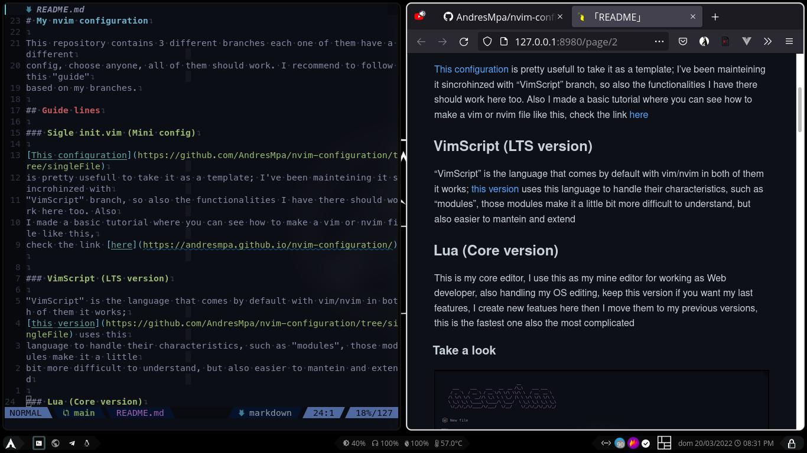

# VimScript (Core version)

Looking for a modular version for nvim/vim? Check this branch. Here I have
my core version for nvim this is what is currently working perfectly (As
perfect as an editor can work); in this version we can work with laguages
such as JS, HTML, CSS, C/C++, Bash, etc... Check at the examples here (Just
bellow)

## Take a look




[Example from YouTube](https://youtu.be/9L-k6n9SQds)

## Prerequisites

Of course you need [nvim](https://github.com/neovim/neovim/wiki/Installing-Neovim)
or [vim](https://www.vim.org/download.php) itself, both of them should work just
right we also need [Plug](https://github.com/junegunn/vim-plug), with is the plugin
manager

### Depencencies

Most of these one will be require by [CoC](https://github.com/neoclide/coc.nvim),
if you don't want any of them try switch CoC for any other plugin such as
[YouCompleteMe](https://github.com/ycm-core/YouCompleteMe)

- [npm](https://www.npmjs.com/get-npm)
  (or [yarm](https://classic.yarnpkg.com/en/docs/install/#debian-stable))
- [nodejs](https://nodejs.org/es/download/)

### Optional

#### Search engine

I'm pretty lazy to check line by line what I'm looking on a file, so I use a
"search engine", this means that I need to extra software to make that work

- [the_silver_search](https://github.com/ggreer/the_silver_searcher)
- [Ack](https://beyondgrep.com/install/)

#### Live server like plugin

This is pretty usefull for those who make web apps; follow step 1; if it doesn't
work by default

- [Installation](https://github.com/turbio/bracey.vim#installation)

#### Markdown support

Follow these steps on your init.vim or .vimrc

```
:source %
:PluginInstall
:call mkdp#util#install()
```

#### Bash support

Since I use a custom OS, I use a lot bash scripting, that why I saw the necessity of
using a tool to make my code more easy to read, that dependecy need of:

- [shfmt](https://diarioinforme.com/como-usar-shfmt-para-formatear-mejor-los-scripts-de-shell/)

#### R support

Sometimes I use R, for those cases I added an R plugin

- [R language](https://linuxize.com/post/how-to-install-r-on-ubuntu-20-04/)
- [Some utils](https://github.com/jamespeapen/Nvim-R/wiki/Installation)

## Quick Start

If you don't know to much about vim or nvim just follow the next steps:

### If you are using Linux or mac

```
git clone https://github.com/AndresMpa/My-NVIM-configuration.git
cd nvim-configuration/ && ./install.sh && exit
nvim
```

### If you are using Windows

```
cd C:\Users\$USER\AppData\Local\nvim
move nvim nvim_old
git clone https://github.com/AndresMpa/nvim-configuration/tree/singleFile
move nvim-configuration nvim
```

Now you must being on neovim (or vim) just make the following commands to
install the plugins and that stuff

```
<SPACE> + <p> + <i>
// <ESC>
:source%
:CocInstall
:call mkdp#util#install()
```

That's it, now it should work

#### Note:

If you feel lost inside nvim or vim and you are using my config, just
press `<SPACE> + <h> + <h>`

---

## Summary of plugins

| Color schema          | Icon theme                     |
| --------------------- | ------------------------------ |
| (Using) Default       | vim-airline/vim-airline-themes |
| morhetz/gruvbox       | vim-airline/vim-airline        |
| kamykn/dark-theme.vim | ryanoasis/vim-devicons         |

| Motion                         | Identantion and syntax     | Utilities                    | Autocomplete                  |
| ------------------------------ | -------------------------- | ---------------------------- | ----------------------------- |
| christoomey/vim-tmux-navigator | leafgarland/typescript-vim | iamcco/markdown-preview.nvim | editorconfig/editorconfig-vim |
| severin-lemaignan/vim-minimap  | maxmellon/vim-jsx-pretty   | terryma/vim-multiple-cursors | wakatime/vim-wakatime         |
| easymotion/vim-easymotion      | pangloss/vim-javascript    | preservim/nerdcommenter      | jiangmiao/auto-pairs          |
| haya14busa/incsearch.vim       | sheerun/vim-polyglot       | KabbAmine/vCoolor.vim        | tpope/vim-surround            |
| scrooloose/nerdtree            | kovetskiy/sxhkd-vim        | turbio/bracey.vim            | alvan/vim-closetag            |
| junegunn/fzf.vim               | jparise/vim-graphql        | mhinz/vim-signify            | sirver/ultisnips              |
| mileszs/ack.vim                | Yggdroot/indentLine        | ap/vim-css-color             |                               |
|                                | rust-lang/rust.vim         | tpope/vim-repeat             |                               |
|                                | tpope/vim-fugitive         |                              |                               |
|                                | neoclide/coc.nvim          |                              |                               |
|                                | z0mbix/vim-shfmt           |                              |                               |
|                                | jalvesaq/Nvim-R            |                              |                               |

## Recommended apps

There's a couple of apps I recommend you to improve a little bit
more your velocity, they are:

- [rofi](https://github.com/davatorium/rofi)
- [Ulauncher](https://ulauncher.io/)
- [Zeal](https://zealdocs.org/)
- [Vimium](https://addons.mozilla.org/es/firefox/addon/vimium-ff/?utm_source=addons.mozilla.org&utm_medium=referral&utm_content=search)
- [Arch Linux](https://github.com/AndresMpa/dotfiles)

## Pats on the back

If you are reading this it means that you want to improve your
velocity or you want to make your own things so, if you start by
nvim or vim It may by a little bit complicated but just at the
beginning them you'll look like a professional "Ninja Dev"
