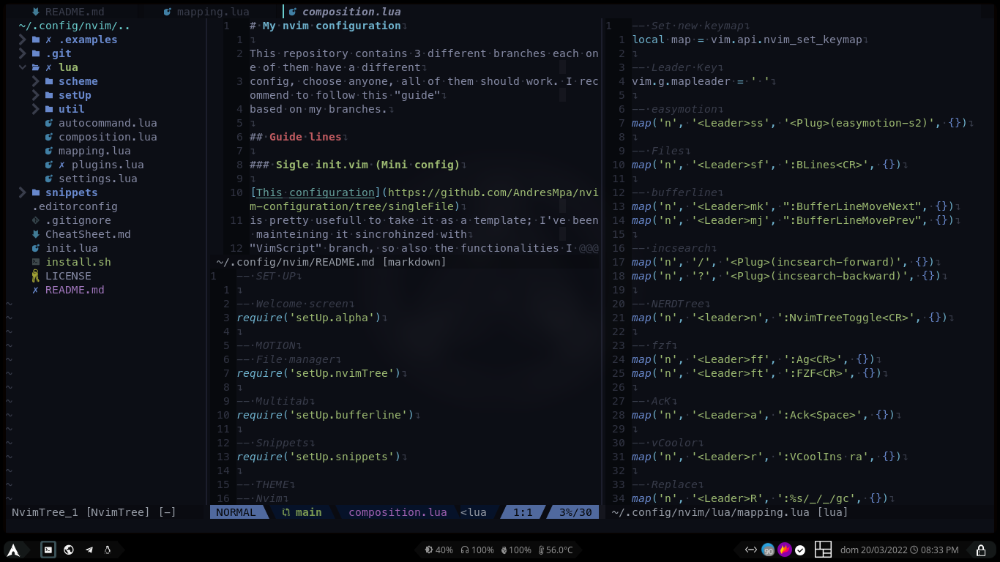

# My nvim configuration


This repository contains 3 different branches each one of them have a different
config, choose anyone, all of them should work. I recommend to follow this "guide"
based on my branches. 

## Guide lines

### Sigle init.vim

[This configuration](https://github.com/AndresMpa/nvim-configuration/tree/singleFile)
is pretty usefull to take it as a template; I've been mainteining it sincrohinzed with
"VimScript" branch, so also the functionalities I have there should work here too. Also
I made a basic tutorial where you can see how to make a vim or nvim file like this,
check the link [here](https://andresmpa.github.io/nvim-configuration/)

### VimScript (Core version)

"VimScript" is the language that comes by default with vim/nvim in both of them it works;
[this version](https://github.com/AndresMpa/nvim-configuration/tree/singleFile) uses this
language to handle their characteristics, such as "modules", those modules make it a little
bit more difficult to understand, but also easier to mantein and extend

### Lua version (Working on this)





[Example from YouTube](https://youtu.be/9L-k6n9SQds)

## Prerequisites

If you want to use Lua you might need [nvim](https://github.com/neovim/neovim/wiki/Installing-Neovim)
otherwise [vim](https://www.vim.org/download.php) should be enough

### VimScript & Single Vim file

#### General dependencies
- As plugin manager I use [vim-plug](https://github.com/junegunn/vim-plug#installation)
- It is necessary to make CoC works to install [npm](https://www.npmjs.com/get-npm)
(or [yarm](https://classic.yarnpkg.com/en/docs/install/#debian-stable))
- Also [nodejs](https://nodejs.org/es/download/) will be necessary

#### Search engine
- [the_silver_search](https://github.com/ggreer/the_silver_searcher)
- [Ack](https://beyondgrep.com/install/)

#### Bash support
- [shfmt](https://snapcraft.io/install/shfmt/ubuntu)

### Lua
- [packer](https://github.com/wbthomason/packer.nvim#quickstart)

## Quick Start

If you don't know to much about vim or nvim just follow the next steps:

### If you are using Linux or mac

```
git clone https://github.com/AndresMpa/My-NVIM-configuration.git
cd nvim-configuration/ && ./install.sh && exit
nvim
```

### If you are using Windows

```
cd C:\Users\$USER\AppData\Local\nvim
move nvim nvim_old
git clone https://github.com/AndresMpa/nvim-configuration/tree/singleFile
move nvim-configuration nvim
```

#### Note:

If you feel lost inside nvim or vim and you are using my config, just press "space + h + h"

Now you must being on neovim (or vim) just make the following commands to install
the plugins and that stuff (You may need to install [Plug](https://github.com/junegunn/vim-plug))

- space + p + i
- esc
- :source%
- :CocInstall
- :call mkdp#util#install()

That's it, now it should work

---

## Summary

| Color schema          | Icon theme                     |
| --------------------- | ------------------------------ |
| (Using) Default       | vim-airline/vim-airline-themes |
| morhetz/gruvbox       | vim-airline/vim-airline        |
| kamykn/dark-theme.vim | ryanoasis/vim-devicons         |

| Motion                         | Identantion and syntax     | Utilities                    | Autocomplete                  |
| ------------------------------ | -------------------------- | ---------------------------- | ----------------------------- |
| christoomey/vim-tmux-navigator | leafgarland/typescript-vim | iamcco/markdown-preview.nvim | editorconfig/editorconfig-vim |
| severin-lemaignan/vim-minimap  | maxmellon/vim-jsx-pretty   | terryma/vim-multiple-cursors | wakatime/vim-wakatime         |
| easymotion/vim-easymotion      | pangloss/vim-javascript    | preservim/nerdcommenter      | jiangmiao/auto-pairs          |
| haya14busa/incsearch.vim       | sheerun/vim-polyglot       | KabbAmine/vCoolor.vim        | tpope/vim-surround            |
| scrooloose/nerdtree            | kovetskiy/sxhkd-vim        | turbio/bracey.vim            | alvan/vim-closetag            |
| junegunn/fzf.vim               | jparise/vim-graphql        | mhinz/vim-signify            | sirver/ultisnips              |
| mileszs/ack.vim                | Yggdroot/indentLine        | ap/vim-css-color             |                               |
|                                | rust-lang/rust.vim         | tpope/vim-repeat             |                               |
|                                | tpope/vim-fugitive         |                              |                               |
|                                | neoclide/coc.nvim          |                              |                               |
|                                | z0mbix/vim-shfmt           |                              |                               |
|                                | jalvesaq/Nvim-R            |                              |                               |

## Apps

There's a couple of apps I recommend you to improve a little bit more your velocity, they are:

- [rofi](https://github.com/davatorium/rofi)
- [Ulauncher](https://ulauncher.io/)
- [Zeal](https://zealdocs.org/)
- [Vimium](https://addons.mozilla.org/es/firefox/addon/vimium-ff/?utm_source=addons.mozilla.org&utm_medium=referral&utm_content=search)
- [Arch Linux](https://github.com/AndresMpa/dotfiles)

## Pats on the back

If you are reading this it means that you want to improve your velocity or you want to make your own things so, if you start by nvim or vim It may by a little bit complicated but just at the beginning them you'll look like a professional "Ninja Dev"
